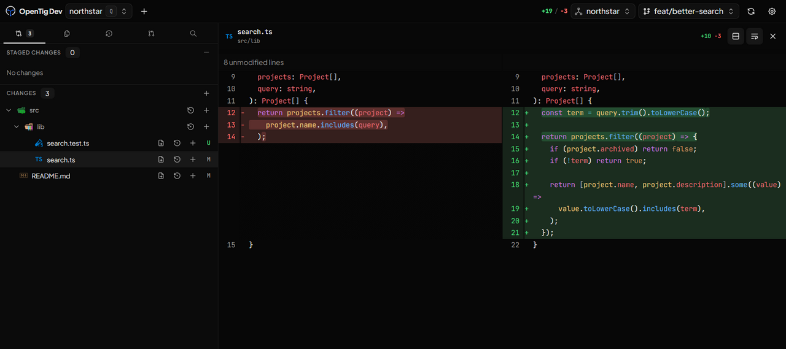

<div align="center">

<h1> OpenTig</h1>

**A focused workspace for reviewing code changes.**

Browse files, inspect diffs, edit, stage, and commit on your computer or a remote server.

[Download for Windows](https://github.com/jorgefl8/opentig/releases/latest) · [Run in your browser](#run-in-your-browser) · [Documentation](docs/README.md) · [Report a bug](https://github.com/jorgefl8/opentig/issues)

</div>



*The browser UI in the Dev build, reviewing a small demo repository.*

> [!IMPORTANT]
> **Early development.** I'm building OpenTig for my own daily workflow and sharing it as it takes shape. Expect bugs, rough edges, and changes. Keep important work backed up and review Git and file operations before confirming them.

## A small workspace for the Git loop

Open a repository, understand what changed, make a quick edit, and commit the work you meant to commit. OpenTig brings the file browser, editor, diffs, and Git controls together in one compact interface.

It works with existing repositories using the Git installation on the host. You can use the Windows desktop app or run the CLI on another machine and reach the same UI from a browser, including on your phone. Repositories and commands stay on the machine running OpenTig.

**AI is optional.** Reviewing, editing, and committing do not require an AI account. If you choose to use it, your installed CLI can draft commit messages and pull-request descriptions for you to review. OpenTig does not run an autonomous coding agent or create commits on its own.

## What you can do

| | |
| --- | --- |
| **Review changes** | Syntax-highlighted split or unified diffs, staged and unstaged files, and merge-conflict resolution. [Details](docs/features.md#changes-diffs-and-commits) |
| **Browse and edit** | File tree, tabs, quick edits, find and replace, repository search, and Markdown, image, HTML, and SVG previews. [Details](docs/features.md#files-and-editing) |
| **Work with Git** | Stage files, commit, pull and push, inspect history, and switch branches and worktrees. [Details](docs/features.md#safe-pull-and-push) |
| **Keep repositories together** | Recent repositories, project groups, and manual relocation without moving files. [Details](docs/features.md#repositories-and-projects) |
| **Review GitHub PRs** | Browse pull requests, inspect their changes, and prepare new PRs through your authenticated `gh` CLI. [Details](docs/features.md#github-pull-requests) |
| **Use a remote server** | Run without Electron, pair your browser, and work with repositories on the server. A single persistent notification tracks connection problems and disappears when you reconnect. [Details](docs/web-access.md) |

The interface defaults to **Plus Jakarta Sans**, with **JetBrains Mono** for code. Choose each independently in Settings → General; existing font selections are preserved.

The [full feature guide](docs/features.md) covers these workflows, optional AI assistance, preferences, and keyboard shortcuts.

## Choose how to run it

| | Available today |
| --- | --- |
| **Desktop app** | Windows x64 installer, with in-app updates. Linux and macOS desktop installers are not published yet. |
| **CLI + browser** | Linux, macOS, and Windows with Node.js 24+ and Git. |
| **Background server** | Linux (systemd), macOS (launchd), and Windows (Task Scheduler), with browser-based updates. |

### Windows desktop

Download the `OpenTig-…-win32-x64-Setup.exe` installer from the [latest release](https://github.com/jorgefl8/opentig/releases/latest). Git must be available on your machine.

> [!WARNING]
> The Windows installer is currently **unsigned**, so Windows may show an unknown-publisher or SmartScreen warning.

### Run in your browser

With **Node.js 24+** and **Git** installed:

```bash
npx --yes @opentig/cli@latest
```

This starts OpenTig locally and opens a one-use browser pairing link. Then choose an existing repository in the UI.

For a server without a desktop:

```bash
npm install -g @opentig/cli@latest
opentig serve
```

Server mode is designed for personal access through **Cloudflare Tunnel**, a **private network such as Tailscale**, or an SSH tunnel. The server listens on `127.0.0.1:6767` by default. A tunnel or HTTPS reverse proxy on the same machine can reach this address without enabling LAN access. For direct access over a private network, bind to its interface with `--host`; alternatively, keep loopback and use a private HTTPS proxy such as Tailscale Serve. OpenTig does not configure these services for you. See [remote access](docs/web-access.md) for setup details.

Pair your browser using the code printed on the server. The folder picker selects **folders on that server**, not on your laptop or phone.

To keep the CLI running after closing the terminal, use `opentig service install`. Linux starts it at boot with lingering; macOS and Windows start it at login and stop it at logout. This CLI service is independent of the desktop app.

See [installation and CLI](docs/getting-started.md) for pinned versions, background service setup, and updates, or [remote access](docs/web-access.md) for connection examples. Paired browsers have the host user's authority: keep access private and do not expose the raw port publicly.

## Where things stand

OpenTig is a young Git client with a built-in editor, not a VS Code fork or a full IDE. It opens existing repositories; cloning and initial remote setup are still Git CLI tasks. GitHub features require `gh`. Optional AI features use Codex, Claude Code, or OpenCode installed and authenticated on the host.

Normal Git work needs no OpenTig account or hosted backend. If you request AI assistance, the selected CLI may send the supplied context to its provider. Read the [security and privacy guide](docs/security-and-privacy.md) for the details.

Feedback, bug reports, and contributions are welcome. See [CONTRIBUTING.md](CONTRIBUTING.md), [development setup](docs/development.md), and the [documentation index](docs/README.md).

## License

[MIT](LICENSE). Bundled third-party assets retain their own licences; see [third-party notices](THIRD_PARTY_NOTICES.md).
