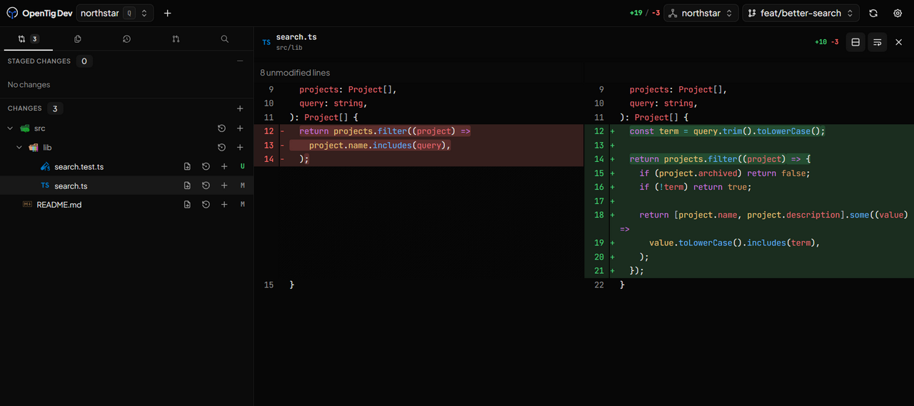

<div align="center">

<h1> OpenTig</h1>

**A focused workspace for reviewing code changes.**

Browse files, inspect diffs, edit, stage, and commit on your computer or a remote server.

[Download for Windows](https://github.com/jorgefl8/opentig/releases/latest) · [Run in your browser](#run-in-your-browser) · [Documentation](docs/README.md) · [Report a bug](https://github.com/jorgefl8/opentig/issues)

</div>



*The browser UI in the Dev build, reviewing a small demo repository.*

> [!IMPORTANT]
> **Early development.** I'm building OpenTig for my own daily workflow and sharing it as it takes shape. Expect bugs, rough edges, and changes. Keep important work backed up and review Git and file operations before confirming them.

## A small workspace for the Git loop

Open a repository, understand what changed, make a quick edit, and commit the work you meant to commit. OpenTig brings the file browser, editor, diffs, and Git controls together in one compact interface.

It works with existing repositories using the Git installation on the host. You can use the Windows desktop app or run the CLI on another machine and reach the same UI from a browser, including on your phone. Repositories and commands stay on the machine running OpenTig.

Development instances display **OpenTig Dev** with stripes inside the name in the desktop and mobile headers and on the welcome screen: black/yellow in the light theme and white/yellow in the dark theme. It follows the instance's Dev profile in both the desktop app and browser UI. The desktop welcome screen has a draggable area along the top edge and follows the selected light or dark theme.

On phones, a compact repository header and bottom navigation leave more room for files and code. Tap the repository context to change branch or worktree, sync, or open Settings; use the open-files button to switch or close tabs. Mobile Pull and Push show pending commit counts and stay disabled when up to date; unpublished branches can still be published. Notifications leave the bottom navigation and open sheets accessible. Files open one folder at a time with breadcrumbs, a folder filter, visible action menus, and multiple selection. Background refreshes keep the current folder visible and preserve its scroll position. Use **Move to…** to choose a destination with the same folder icons as Files, without dragging: touch and pen gestures scroll, while mouse dragging stays available on desktop. Search keeps its query and options in one compact row; the pull request toolbar aligns its refresh, filter, and New buttons at the same touch-friendly height. The commit form opens separately from staging, and mobile history combines search and grouping in one toolbar with compact rows that retain touch-sized expand controls. Short landscape phone screens retain the mobile layout; the navigation steps aside when the software keyboard is open.

**AI is optional.** Reviewing, editing, and committing do not require an AI account. If you choose to use it, your installed CLI can draft commit messages and pull-request descriptions for you to review. OpenTig does not run an autonomous coding agent or create commits on its own. The official Grok Build CLI also supports commit messages, split proposals, and pull-request drafts, with model selection, cancellation, and usage history. It requires Grok Build 1.0.46 or later in the 1.x series and `grok login` or `XAI_API_KEY`. Grok uses an isolated temporary profile with its built-in models; custom CLI configuration is excluded. See [AI privacy](docs/security-and-privacy.md#ai-privacy) for execution controls and cleanup.

Settings → AI assistance shows the last saved provider states and model catalogs, including the selected harness’s **Last checked** timestamp. Checks are saved locally and reused after reopening Settings or restarting OpenTig; they run automatically when no saved result exists or an executable path changes. Changing the selected harness or model does not repeat discovery, and previous results stay visible during a refresh. Generating a commit message or PR draft still validates the selected CLI’s current availability and authentication. **Check again** discovers CLIs installed after OpenTig starts, including native user locations such as `~/.opencode/bin`, `~/.grok/bin` and `~/.local/bin`, common package-manager launchers, and refreshed user PATH entries. Discovery and execution share the same environment; an older or broken installation does not hide a later compatible one. Each harness reports missing, unusable, incompatible and authentication states independently. OpenCode model checks try a private server first and fall back to the normal CLI service if its catalog is empty or cannot be loaded, using the same executable and environment. If neither returns models, Settings explains the missing catalog without treating it as a failed login. The AI settings dialog uses a wider desktop layout with a responsive provider grid. Its **Advanced CLI detection** accordion shows the selected path and its source, lets you save an absolute executable path per harness or reset it to Automatic. User-environment refresh is automatic. If it fails or exceeds its timeout (15 seconds on Windows; five seconds on Linux and macOS), detection continues with the inherited environment and known installation locations. On Linux and macOS, refresh runs Bash, Zsh or Fish startup files; on Windows it reads the saved user and machine environment. Custom paths belong to the backend host, including when using a browser. Existing services do not need reinstalling. Windows does not automatically use CLIs installed inside WSL; run the backend inside WSL to use that environment.

File removal uses system Trash with literal paths. The Trash dependency is temporarily pinned to 9.0.0 to avoid an unpatched transitive vulnerability; when the backend runs inside WSL, it uses Linux Trash. See [third-party notices](THIRD_PARTY_NOTICES.md#trash) for the dependency details.

## What you can do

| | |
| --- | --- |
| **Review changes** | Syntax-highlighted split or unified diffs, staged and unstaged files, and merge-conflict resolution. Diff headers show the file name and directory directly, without repeating the path in a tooltip. Sticky file headers keep an opaque background on hover so scrolled code does not show through. [Details](docs/features.md#changes-diffs-and-commits) |
| **Browse and edit** | File tree, tabs, quick edits, find and replace, repository search, and Markdown, image, HTML, and SVG previews. Markdown images load relative to the document within the repository, including PNG and SVG files. Code, diffs, and merge conflicts share syntax detection for nested Dockerfiles and Makefiles, uppercase extensions, XML project files, JSON with comments, environment files, Git configuration, and installer scripts. [Details](docs/features.md#files-and-editing) |
| **Work with Git** | Stage files, commit, pull and push, publish branches with or without new commits, inspect compact commit graphs with publication colors and PR references, and switch branches and worktrees. **Manage branches** filters local and remote branches, groups them by remote, and fetches with pruning of obsolete remote references. Inspect tracking branches and PRs for `origin`, create a local tracking branch from the Local branches details without switching checkout, or delete one remote branch with confirmation while retaining local branches and worktrees. Remote deletion checks the destination and expected commit and protects the remote’s default branch. Branch and worktree rows show details in the side panel without hover tooltips. Branches already deleted on the server offer **Fetch and clean up** to remove their cached references. Pull and push keep their own progress and result notifications, independently of AI messages. Resolving conflicts dismisses the repository’s conflict notice without closing an in-progress pull. Publishing sets the upstream and lets you choose a remote when needed. [Details](docs/features.md#safe-pull-and-push) |
| **Keep repositories together** | Added repositories stay available until you remove them, with project groups and manual relocation without moving files. Opening a repository keeps its saved position; new repositories are added at the end of their group. Manage projects lets you drag projects and repositories or move them with up/down buttons, including repositories without a project. On mobile, use larger up/down buttons with free scrolling; moving an item preserves scroll and focus and briefly highlights its new position. Dragging is available on desktop. The selector and number shortcuts follow that saved order. The repository dialog offers location shortcuts, recent checkouts, breadcrumbs, folder filtering, hidden-folder controls, and Git detection with branch labels. Select a repository before opening it, or use the pencil button or Ctrl+L to edit its path, then browse with Enter or the arrow button; desktop users can also use the native folder picker. [Details](docs/features.md#repositories-and-projects) |
| **Review GitHub PRs** | Open the repository on GitHub from the toolbar and see the current branch or worktree’s PR beside the branch selector, including merged PRs with a purple merge icon. When several PRs use the same branch, the most recently updated open PR takes priority; otherwise the most recently updated PR is shown if it was merged. The same merged status appears in the mobile repository menu. Browse pull requests, inspect changes and native stacks, and prepare new PRs. CLI availability is checked once at startup and reused across repositories and PR filters; returning to PRs keeps cached results visible during background refreshes. Use **Refresh** in PRs to check CLI availability again. **Settings → GitHub** shows the last checked CLI version, saved accounts, active global account and repository identity. Choose **Automatic** or a saved account per repository, shared across worktrees: all GitHub reads and PR creation use that choice without switching the global `gh` account. Automatic verifies the SSH user; HTTPS uses the active CLI credentials, including backend environment tokens. Unverifiable SSH requires an explicit choice. Checks are manual and saved between restarts; adding accounts offers official `gh` login instructions. The compact repository summary separates its GitHub account from the effective Git commit author, with closely spaced sections for account selection, authorship and CLI status. **Edit authorship** reviews name and email before saving repository-local Git settings for future commits, shared across worktrees and other Git tools. Overrides from environment, worktree or custom author/committer settings must be managed separately. Changing GitHub accounts never changes authorship or Git/SSH authentication. [Details](docs/features.md#github-pull-requests) |
| **Use a remote server** | Run without Electron, pair your browser, and work with repositories on the server. Once paired, use Settings → Web access to pair more browsers with a five-minute, one-use link or QR at your current browser address, including through a tunnel. Web access and LAN access are shown separately; listener configuration stays on the server. Rename or revoke paired browsers from the same panel. Browsers without a valid session see pairing instructions without a startup error notification. A single persistent notification tracks connection problems and disappears when you reconnect. [Details](docs/web-access.md) |

The interface defaults to **Plus Jakarta Sans**, with **JetBrains Mono** for code. Dates throughout the interface use **DD/MM/YYYY**, including history, commits, branches, worktrees, pull requests, logs, updates, and browser sessions. Timestamps retain the local time in 24-hour format; pairing expiry dates in the CLI use the same format. Settings → General groups appearance, files and repository sync into compact rows, with separate font selectors and a text preview; changes apply immediately and existing selections are preserved. Remote checks offer common intervals or a custom value from 5 to 300 seconds, in steps of 5, plus Off for manual checks. The toolbar Refresh button and Ctrl+R fetch remote Git changes even when automatic checks are off, then refresh the local workspace. The Refresh icon rotates while refreshing and returns to its resting state when finished. They also check for app updates immediately, without waiting for the five-minute update interval. Diffs and file editors keep the active interface background while sharing syntax colors with Markdown previews, regardless of which view opens first. Repository, worktree, branch, AI model, project assignment, and pull-request base dropdowns share a compact, searchable layout that follows the active light or dark theme. A small gap between options keeps selected and hovered rows visually distinct. Scrolling a dropdown dismisses its row tooltips, and tooltips hide when their anchor is clipped, so hints stay tied to visible options. Repositories and worktrees retain a second line for their checkout; other options use a single line, with larger touch targets on phones. The repository dropdown can use up to 80% of the available viewport height when there are many repositories, with search and management always visible; other dropdowns keep their compact height. Toolbar dropdowns keep a fixed management action, while models can be searched by name or identifier and grouped by provider. Default (CLI) and No project remain available when filtering. Repository number shortcuts remain available until you focus the search field.

The [full feature guide](docs/features.md) covers these workflows, optional AI assistance, preferences, and keyboard shortcuts.

History keeps the existing sidebar sections and opens commits, files, and GitHub PR references in the right-hand viewer. Switch row density, search loaded commits without losing graph context, or group complete merge branches. Theme colors distinguish local commits (amber), published work and merge branches (OpenTig blue), and the locally known base branch (neutral gray); squash histories stay linear. [History details](docs/features.md#history)

GitHub PRs show native stack positions such as **2/3**. Open the indicator in the list or right-hand viewer to navigate between layers and see their states and base branch. Stack details load on demand; a failed refresh keeps previously loaded layers available with a notice. Stack navigation is read-only.

## Choose how to run it

| | Available today |
| --- | --- |
| **Desktop app** | Windows x64 installer, with in-app updates. Linux and macOS desktop installers are not published yet. |
| **CLI + browser** | Linux, macOS, and Windows with Node.js 24+ and Git. |
| **Background server** | Linux (systemd), macOS (launchd), and Windows (Task Scheduler), with browser-based updates. |

### Windows desktop

Download the `OpenTig-…-win32-x64-Setup.exe` installer from the [latest release](https://github.com/jorgefl8/opentig/releases/latest). Git must be available on your machine.

Settings → Updates links to the installed stable version’s release notes on GitHub, even when no update is available. When a new release is offered, its notes have a separate link labeled with the update version. Development instances show **OpenTig Dev** and the base package version, without labeling it as an installed stable release. Automatic stable updates are disabled in Dev; the panel explains how to rebuild and restart a source checkout or replace a downloaded Dev ZIP. Browser Dev instances show instructions for rebuilding and restarting the Dev server.

If the desktop server cannot start, the offline screen shows the error and offers **Restart OpenTig** to close and reopen the whole application, plus **Open server log**. The rotating log at `%APPDATA%\OpenTig\logs\server.log` records startup stages, version, port, elapsed time, error codes and stack traces with credentials redacted, including failures that happen before the server is ready.

> [!WARNING]
> The Windows installer is currently **unsigned**, so Windows may show an unknown-publisher or SmartScreen warning.

### Run in your browser

With **Node.js 24+** and **Git** installed:

```bash
npx --yes @opentig/cli@latest
```

This starts OpenTig locally and opens a one-use browser pairing link. Then choose an existing repository in the UI.

For a server without a desktop:

```bash
npm install -g @opentig/cli@latest
opentig serve
```

Server mode is designed for personal access through **Cloudflare Tunnel**, a **private network such as Tailscale**, or an SSH tunnel. The server listens on `127.0.0.1:6767` by default. In the desktop app, **Settings → Web access** enables paired browsers independently of the listener and is off by default. Disabling it asks for confirmation with a red **Disable Web access** button and explains that paired devices stay saved. Confirming pauses browser access, disconnects browsers, and invalidates pending pairing codes without restarting the private desktop session. Paired devices stay saved across restarts; enabling Web access again restores access for their still-valid sessions. Use **Revoke browsers** or revoke an individual device to remove saved access permanently. The server status and endpoints are grouped with the separate **LAN access** switch. **Pair a browser** appears only when Web access is enabled and offers **Local**, **LAN** when available, or **My domain**. Choosing My domain reveals the public URL editor for tunnel access; **Save and use** saves and selects that address for the link and QR. Saved domains can be edited or removed, and link creation waits until edits are saved or cancelled. The pairing display can be closed while its link is being created or after it is ready, and disappears when it expires; closing only hides it and does not invalidate a copied code. Existing enabled LAN settings migrate to enabled Web and LAN access. Older loopback installations with active paired browsers keep Web access enabled without enabling LAN; new installations remain closed, and an explicit Web access OFF setting stays off. The standalone CLI remains available for browsers. A tunnel or HTTPS reverse proxy on the same machine can reach this address without enabling LAN access. For direct access over a private network, bind to its interface with `--host`; alternatively, keep loopback and use a private HTTPS proxy such as Tailscale Serve. OpenTig does not configure these services for you. See [remote access](docs/web-access.md) for setup details.

Pair your browser using the code printed on the server. The folder picker selects **folders on that server**, not on your laptop or phone.

If a server upgrade makes an open client's version incompatible, its connection notification offers **Reload** to load the current interface from the server. The browser still warns about unsaved editor changes before reloading.

To keep the CLI running after closing the terminal, use `opentig service install`. Linux starts it at boot with lingering; macOS and Windows start it at login and stop it at logout. This CLI service is independent of the desktop app.

See [installation and CLI](docs/getting-started.md) for pinned versions, background service setup, and updates, or [remote access](docs/web-access.md) for connection examples. Paired browsers have the host user's authority: keep access private and do not expose the raw port publicly.

## Where things stand

OpenTig is a young Git client with a built-in editor, not a VS Code fork or a full IDE. It opens existing repositories; cloning and initial remote setup are still Git CLI tasks. GitHub features require `gh`. Optional AI features use Codex, Claude Code, or OpenCode 2 installed and authenticated on the host.

Normal Git work needs no OpenTig account or hosted backend. If you request AI assistance, the selected CLI may send the supplied context to its provider. Read the [security and privacy guide](docs/security-and-privacy.md) for the details.

Feedback, bug reports, and contributions are welcome. Development supports running tests related to changed source files; CI skips heavy jobs for prose-only documentation changes and cancels superseded PR runs. See [CONTRIBUTING.md](CONTRIBUTING.md), [development setup](docs/development.md), and the [documentation index](docs/README.md).

## License

[MIT](LICENSE). Bundled third-party assets retain their own licences; see [third-party notices](THIRD_PARTY_NOTICES.md).
