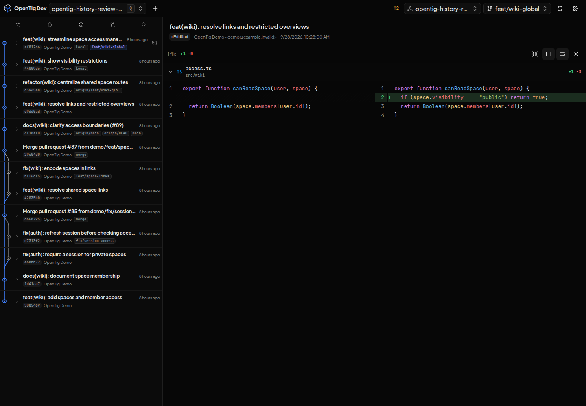
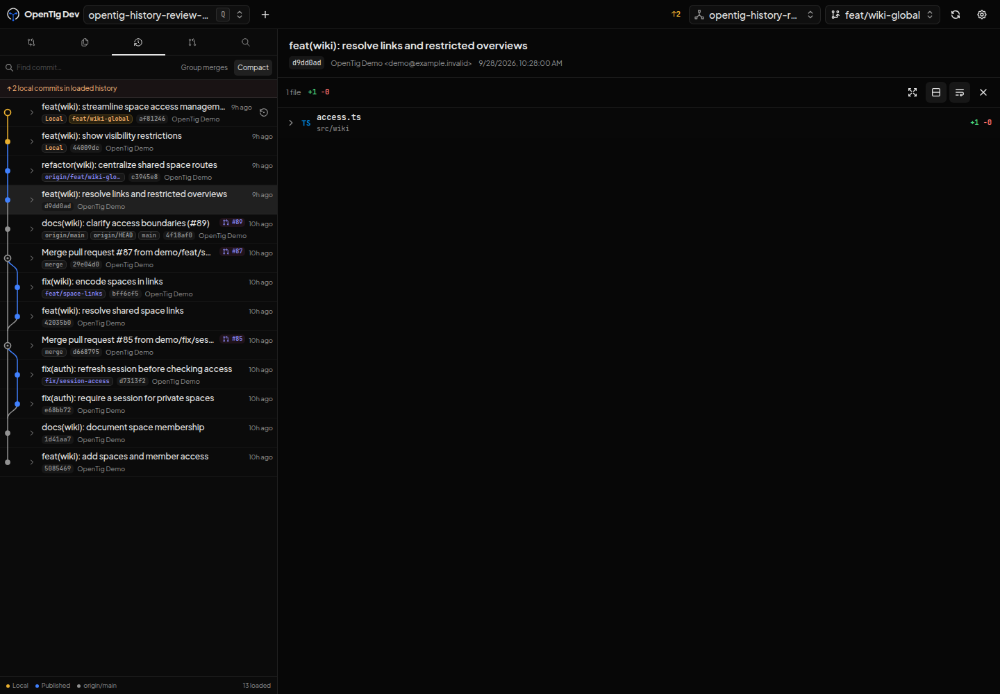
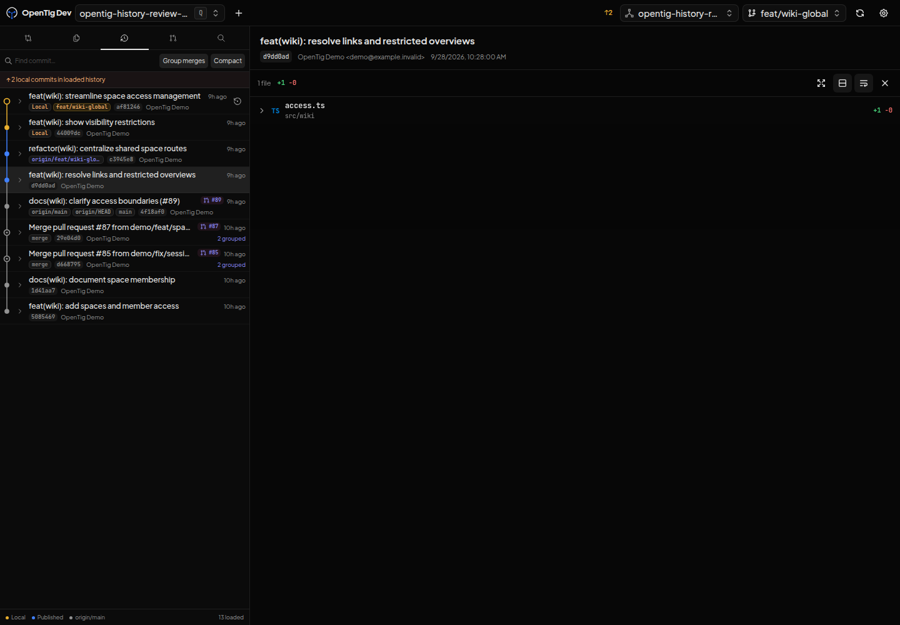
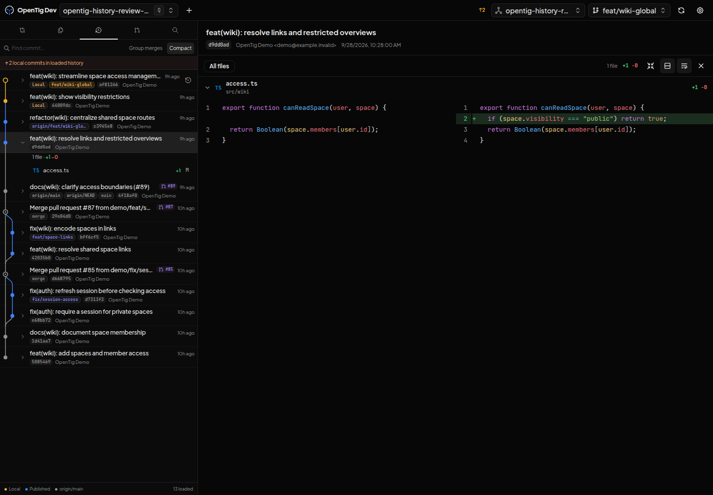

# History UI review

These screenshots were taken in an isolated development environment using a 1440 × 1000 viewport and the same example Git repository. Its commits, author, code, and PR-number references are demonstration data. No production repository data is included.

| Before | After |
| --- | --- |
|  |  |

The sidebar remains 400 px wide and the viewer begins at the same position. Both screenshots select the same commit. The before image uses the application before this change (base `c147080`); the after image uses the rebuilt development client. The served history module and stylesheet were compared byte-for-byte with the local build. The updated captures use the approved theme palette: amber for local commits, OpenTig blue for published work and merge branches, and neutral gray for the base line.

Browser checks covered 42/56 px density, merge grouping, search with and without results, revealing grouped search matches, selection, file expansion, graph continuations, and opening file diffs on the right. A separate check on the OpenTig repository opened its existing GitHub PR #9 from a history reference without leaving the History section. The demo references themselves are not claims about actual GitHub PRs.

The palette update was also checked in both light and dark themes, including the published color on merge lanes and the unchanged 400 px viewer boundary.

The collaborative preview reported no connected automation host. Browser verification therefore used isolated headless Chromium against the development build. This is browser UI verification, not a visible Electron desktop launch or Windows validation.
