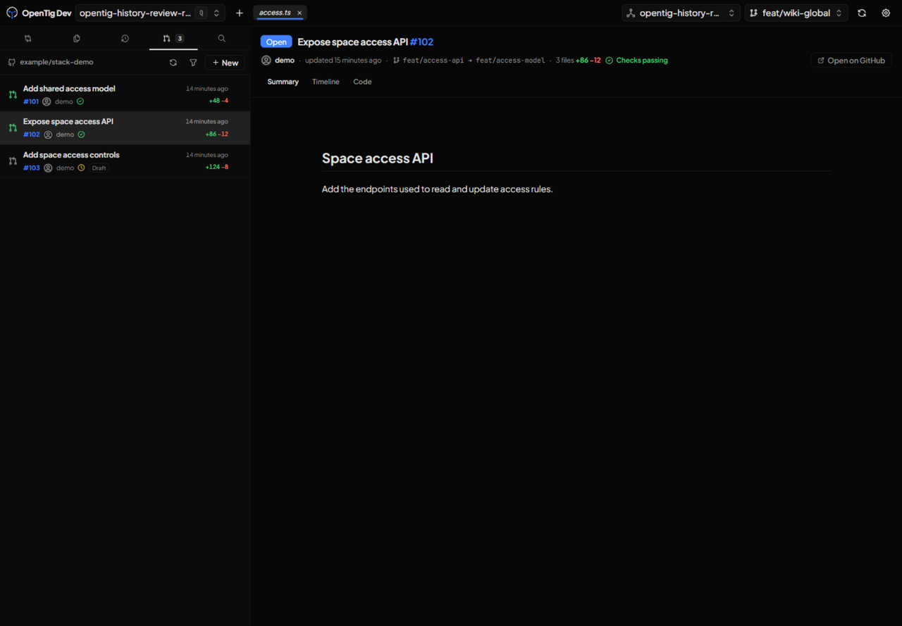
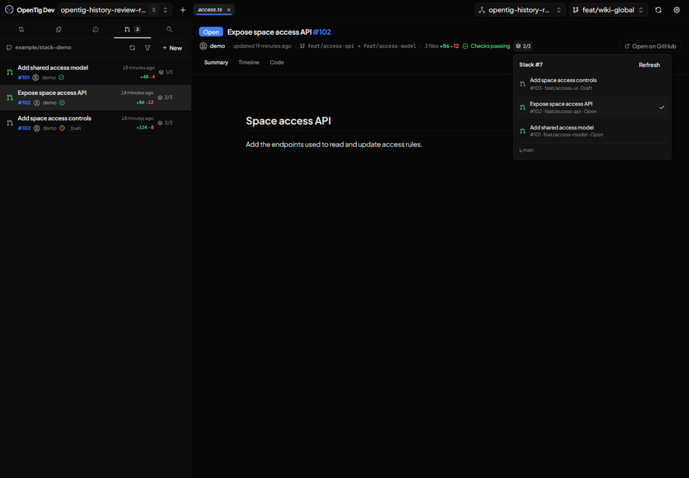

# Native PR stack navigation

These captures show the actual application in an isolated development environment with the same sample repository and controlled GitHub transport responses. The repository, author, PRs, and stack are demonstration data; the screenshots do not claim that these sample PRs exist on GitHub. Application code and assets are not mocked.

| Before | After |
| --- | --- |
|  |  |

Both captures select PR #102 at a 1440 × 1000 CSS viewport. The before capture uses base commit `8719690`; the after capture uses the rebuilt development client. The sidebar remains 400 CSS pixels wide and details still open in the right-hand viewer. The served PR list module, PR viewer module, and stylesheet were verified against the packaged build by SHA-256.

The collaborative browser checks covered lazy stack requests, opening the menu from either location, selecting another layer, independent list-badge activation, keyboard opening/navigation/dismissal, keeping saved layers after a refresh failure, retry recovery, and confirmed absence. The UI contains no nested buttons.

Separately, the real GitHub service and parsers were exercised read-only against a public native stack: GraphQL membership agreed with the REST stack number and ordered layers. Automated tests cover batching, fallback when optional membership is unavailable, malformed responses, and the distinction between absence and transient/authentication errors.

The packaged Linux development application passed the packaged desktop/server checks and a disposable Xvfb process-launch smoke check. This is not a visible desktop launch or Windows validation. Browser diagnostics retained pre-existing CSP warnings for fonts and inline scripts.
